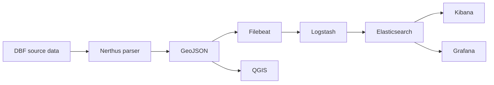

# Nerthus Stack

[](https://github.com/tiefengrund/Nerthus/actions/workflows/lint.yml)


Inselnetzfähiger stack auf containerbasis, läuft im venv

Nerthus is an air-gap capable platform for ingesting, normalizing,
indexing and visualizing geological and hydrogeological data.

The platform uses Ansible, containerized services, Filebeat, Logstash,
Elasticsearch, Kibana and Grafana. Geological source data can be
converted from legacy DBF datasets into GeoJSON for use both within
Nerthus and in external GIS applications such as QGIS.

## Project status

Nerthus is currently a proof of concept under active development.
Interfaces, roles and data mappings may still change.

## Ziel

## Data flow



wir deployen die analyse-infrastruktur via ansible

```bash
ansible-playbook -i inventories/testfeld/hosts.yml site.yml
```

## Komponenten

- lokale Container Registry
- interne PKI / Zertifikate
- Image Loader für tar-Images
- Elasticsearch
- Logstash
- Kibana
- Grafana
- Filebeat
- PCAP Parser Worker

## Verzeichnislayout auf Zielsystem

```text
/srv/tactical/
  registry/
  elasticsearch/
  logstash/
  kibana/
  grafana/
  filebeat/
  parser/
  captures/
    incoming/
    parsed/
    archive/
  certs/
```

## Offline Images

Container-Images als `.tar` nach `files/images/` legen.
Die Images legen mit bei, sind bisschen groß,aber hilft erstmal nichts

Beispiel:

```text
files/images/
  registry_2.tar
  elasticsearch_8.15.3.tar
  logstash_8.15.3.tar
  kibana_8.15.3.tar
  grafana_11.2.0.tar
  filebeat_8.15.3.tar
  tactical-pcap-parser_1.0.0.tar
```

## Deployment

```bash
ansible-galaxy collection install -r requirements.yml
ansible-playbook -i inventories/testfeld/hosts.yml site.yml
```

## Hinweis

Das ist erstmal nur ein POC, und erstmal nur zum pcaps analysieren
Default Login Grafana: admin/admin

## Phasen

```text
00-prep      Host vorbereiten: Pakete, Python venv, Container Runtime,
10-runtime   PKI, lokale Registry, Offline Images
20-stack     Elastic, Logstash, Kibana, Grafana, Filebeat, PCAP Parser
```

## Prep separat ausführen

```bash
ansible-playbook -i inventories/testfeld/hosts.yml playbooks/00-prep.yml
```

## Komplettlauf

```bash
ansible-playbook -i inventories/testfeld/hosts.yml site.yml
```

## Lokale Ansible venv auf dem Steuerrechner

```bash
python3 -m venv .venv
source .venv/bin/activate
pip install -r requirements.txt
ansible-galaxy collection install -r requirements.yml
```

## Cleanup

```bash
ansible-playbook -i inventories/testfeld/hosts.yml playbooks/40-cleanup.yml
```

## Pfade:

## Licensing

The licensing model for this project is determined by the project owner.

No public license has been assigned to this repository.
