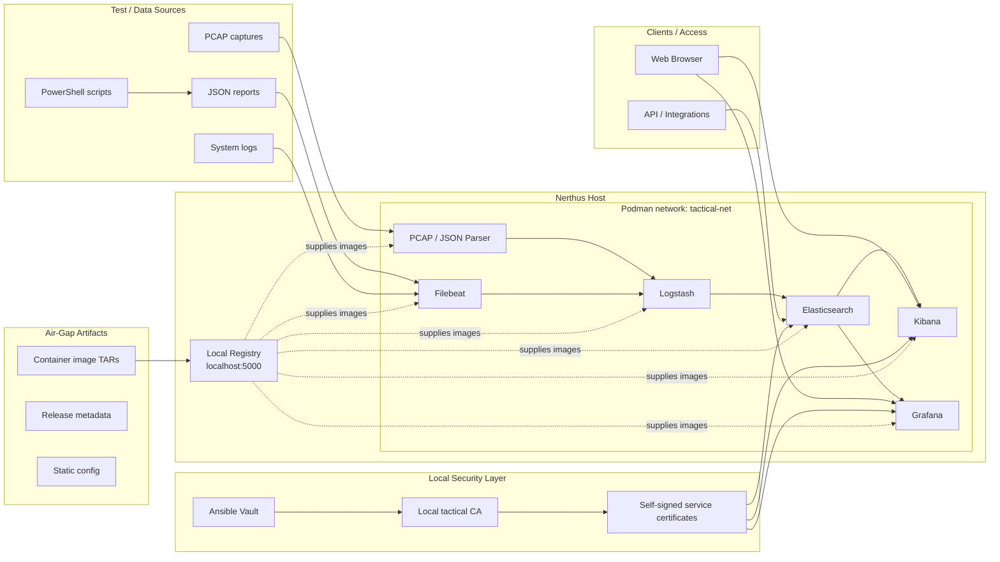
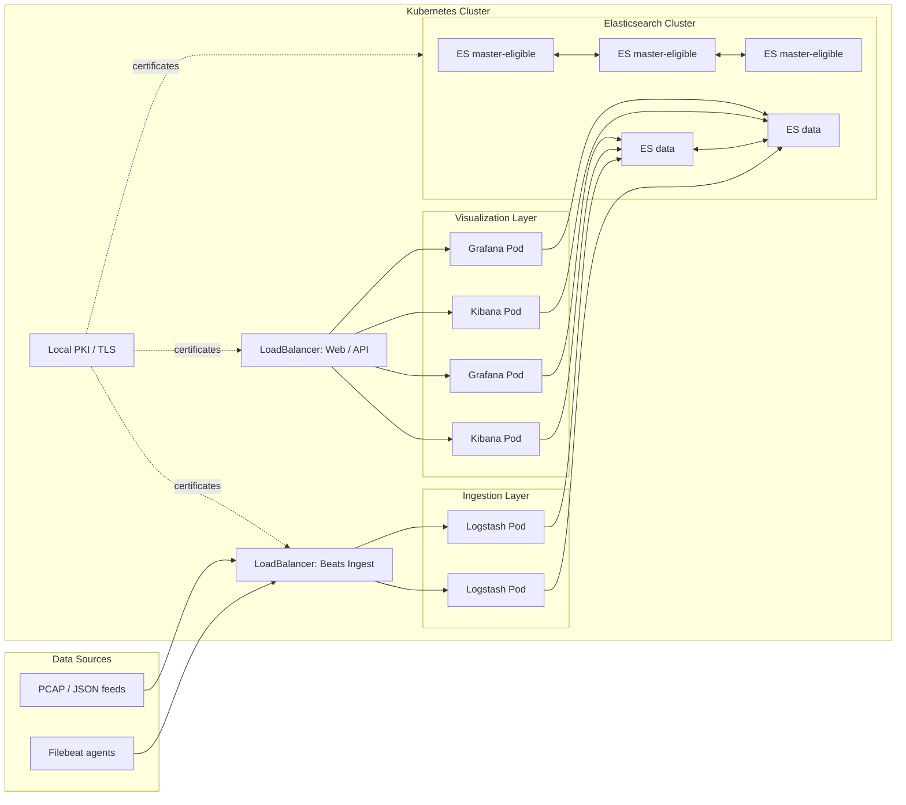

# Architecture

Tactical Core Observability does not replace existing test automation.

Existing scripts and tools produce structured output, mainly JSON. This project ingests that output, normalizes it and makes it searchable and visible through dashboards.

## Purpose

Nerthus is an observability and analytics layer for structured test data.

The platform is intended to ingest, normalize and visualize artifacts produced during testing of tactical communication systems, including deployments based on Tactical Core.

It complements existing tooling by providing searchable data, dashboards and historical analysis without changing existing test workflows.

## Design principles

- Existing test logic stays untouched.
- Raw input data is preserved.
- Normalized data is derived from source data.
- The stack must work in air-gapped environments.
- Internet access is optional and only used during development or release preparation.

## Future Kubernetes Architecture

The current deployment targets a single observability host using Podman.

A future target architecture may run the stack on a Kubernetes cluster with approximately five nodes. This allows the platform to scale ingestion, storage and visualization workloads independently as data volume grows.

## Scaling notes

Filebeat is expected to scale well against multiple Logstash endpoints when configured with `loadbalance: true`.

Logstash can be scaled horizontally for ingestion, but pipelines must be designed carefully. Stateful inputs, persistent queues and duplicate processing need to be considered.

Elasticsearch must not be treated as a simple stateless workload behind a generic load balancer. It requires explicit cluster design, persistent storage, shard allocation, replicas and master election resilience.

Kibana can be scaled behind a load balancer. It primarily depends on the Elasticsearch cluster and shared configuration.

The main reason for this future architecture is data growth. Once analysis becomes useful, the amount of collected data will increase naturally. The platform therefore needs a path from a single-node tactical deployment to a clustered deployment model.
